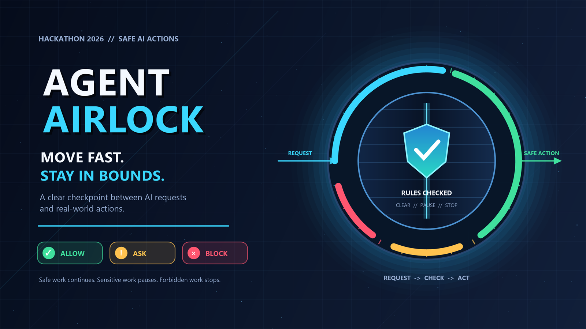

# Agent Airlock



## Tagline

**Give AI agents room to move, not room to break the rules. Agent Airlock checks each mission before takeoff, pauses risky actions for approval, and blocks forbidden actions before they reach real systems.**

---

## Why this problem matters

AI agents have hands now.

They do not just answer questions. They can change code, send messages, update work items, search company data, run workflows, and touch production systems.

But many of the rules controlling those actions still live inside prompts:

> Never bypass required review.

> Ask before changing anything outside my computer.

> Never send sensitive information outside the company.

> Work on your own, but do not do anything risky.

These instructions are helpful, but they are not strong controls. They may be incomplete, hidden inside a long prompt, or understood differently by different agents.

This creates four common problems:

1. **Unclear permissions** - A request says what the user wants, but not everything the agent may do.
2. **Different behavior** - Each team writes its own rules, so similar agents act differently.
3. **Poor approval choices** - Users either approve every small step or give the agent too much freedom.
4. **Missing explanations** - Activity logs may show what happened without clearly showing why it was allowed or blocked.

```text
 TODAY

 Request + instructions + permissions + safety rules
                         |
                         v
                   ONE LARGE PROMPT
                         |
                         v
                      AI AGENT
                         |
                         v
                    REAL SYSTEMS
```

Free-form text is a great way to describe a goal. It is a poor place to hide important permissions.

---

## The idea

**Agent Airlock is a checkpoint between what someone asks an AI agent to do and what the organization allows it to do.**

The user describes the outcome. The organization keeps its rules separate. Agent Airlock combines them into a clear mission before work begins.

```text
                        ORGANIZATION RULES
                                |
                                v
 USER REQUEST  ----------> [ AGENT AIRLOCK ] ----------> AI AGENT
                                |
                 +--------------+--------------+
                 |              |              |
                 v              v              v
              ALLOW          ASK FIRST        BLOCK
                 \              |              /
                  +-------------+-------------+
                                |
                                v
                       CLEAR ACTIVITY RECORD
```

The agent stays free to solve the problem inside the approved space. It cannot create new permissions for itself along the way.

---

## What we are building

The hackathon prototype will run locally and prove one complete flow.

### 1. A clear mission

Agent Airlock turns the request into a short **agent contract** that a person can review.

```text
 +------------------------------------------------------+
 |                  AGENT CONTRACT                      |
 +------------------------------------------------------+
 | Goal        What outcome is requested?               |
 | Data        What information may be used?            |
 | Tools       What may the agent use?                  |
 | Changes     What may the agent modify?               |
 | Approvals   When must a person confirm?              |
 | Limits      What must never happen?                  |
 | Records     What must be saved for review?           |
 +------------------------------------------------------+
```

The request helps describe the goal. It does **not** grant permission.

### 2. A check before work starts

Agent Airlock compares the contract with trusted rules and catches simple conflicts, such as:

- A read-only task includes a write action.
- A task asks for a production change where production writes are forbidden.
- An online action has no approval step.

### 3. A ready-to-use rule file

The prototype turns the approved contract into a rule file. Microsoft's Agent Control Specification and Agent Governance Toolkit use that file to decide whether an action can run. Agent Airlock adds the easy mission review and the check before work begins.

### 4. A check before important actions

Local actions such as reading files, editing a working copy, and running tests can continue automatically. A simulated online write pauses for approval. A forbidden action is stopped.

### 5. A simple approval screen

When approval is needed, the user sees the exact action, why it is paused, and what will happen next.

### 6. A readable activity summary

The final view shows the request, rules, approvals, blocked attempts, completed actions, and reasons in one place.

The demo needs no special Microsoft account, cloud setup, administrator role, or real online write. It uses a local repository, sample rules, and simulated outside actions.

---

## Easy to share and adopt

Agent Airlock can be shared the same way teams already share code. The first version does not need a new central service.

The contract, organization rules, examples, and Agent Airlock files can live in GitHub or Azure DevOps.

```text
 +--------------------------------------------------+
 |             GITHUB OR AZURE DEVOPS               |
 +--------------------------------------------------+
 | agent contract                                   |
 | organization rules                              |
 | Agent Airlock tool                               |
 | examples and tests                               |
 +-------------------------+------------------------+
                           |
                           v
                  PULL REQUEST REVIEW
                           |
                           v
                   AUTOMATIC CHECK
             GitHub Actions or Azure Pipelines
                           |
                           v
                  APPROVED RULES RELEASE
                           |
                           v
                     LOCAL AI AGENT
```

A team adds the tool and two small files to its project. Changes go through a pull request. The automatic check shown above can create an approved release through GitHub Releases, GitHub Packages, or Azure Artifacts. The agent loads that release when it starts.

The same check can run on a developer's computer or in the repository. Teams can see who changed each rule, review it before use, and return to an earlier version if needed.

---

## The hackathon demo

A user asks:

> Investigate this bug, fix it, and complete the change without interrupting me.

Agent Airlock shows the mission before the agent starts:

```text
 MISSION: Fix the reported bug

 ALLOWED
   + Read the local repository
   + Edit the working copy
   + Run tests
   + Create a local branch

 ASK FIRST
   ? Simulate pushing a branch online

 BLOCKED
   x Push directly to the protected branch
   x Change production resources

 REASON
   Online writes need confirmation.
   Protected changes must go through review.
```

The agent reads the sample issue, changes local files, and runs tests without repeatedly interrupting the user.

It then tries a simulated online write. Agent Airlock pauses and asks for approval. The user can approve or reject that exact step.

Next, the agent attempts the forbidden protected-branch update. Agent Airlock blocks it and points the agent toward the safer branch-and-review path.

The user can even add "do everything automatically" to the request. The result does not change because the rule is kept outside the prompt.

Finally, we change the local rule and run the same request again. The new decision takes effect without rewriting the prompt or changing the agent.

The closing screen shows:

```text
 Requested       Fix and complete the bug
 Ran locally     Read, edit, branch, and test
 Needed approval Simulated online write
 Blocked         Direct protected-branch write
 Reason          Organization rule
 Final result    Only approved actions ran
```

> **The agent tries to cross the line. The airlock holds.**

---

## Why people should care

| Audience | What improves |
|---|---|
| **People using agents** | They know what the agent may do and are interrupted only when needed |
| **Developers** | They stop hiding the same safety rules in every prompt |
| **Security and IT teams** | They can set clear limits and see them applied |
| **Reviewers and auditors** | They can see what was requested, approved, blocked, completed, and why |

The business value is simple: organizations can adopt useful agents faster, reduce repeated safety work, avoid risky actions, and make approvals less frustrating.

---

## What success looks like

After the demo, a judge should be able to answer:

1. What did the user ask the agent to do?
2. Which steps ran without interruption?
3. Which step needed approval?
4. Which step was stopped, and why?
5. Could prompt wording override the organization rule?
6. Could the team review and publish a new rule through its code repository?
7. Did the final summary explain every important result?

---

## Follow-up / Out of scope for this hackathon

The first prototype proves one local coding example. The following ideas are valuable, but they are not promises for the initial demo:

- **More agent platforms** - Use the same contract with Microsoft Agent Framework, Copilot Studio, Microsoft Foundry, and other agent tools.
- **Live Microsoft connections** - Connect with Agent 365, Entra, Defender, Purview, and company approval systems. These may require licenses and administrator setup.
- **Real online actions** - Use controlled test repositories, cloud resources, messages, and production systems with proper credentials and safeguards.
- **More business scenarios** - Cover operations, company search, external messages, financial work, and agents working with other agents.
- **Central control and reporting** - Add a live dashboard, an emergency stop, company-wide update tracking, and removal of old rules. Repository review and releases are already part of the first approach.
- **Time and cost improvements** - Find repeated work, unnecessary tools, slow approvals, and opportunities to use less expensive AI options.
- **Multi-step safety** - Check whether a series of individually allowed actions becomes risky when combined.
- **Production readiness** - Add trusted releases, fast rule removal, secure sign-in and records, recovery, privacy checks, and testing for large use.

---

## The end state

The long-term goal is for every important AI task to carry a short mission and an approved set of rules.

Routine work can continue. Sensitive steps can pause. Forbidden steps can stop before reaching a real system. Every important choice can leave a clear reason.

Teams can update a shared rule instead of searching through many prompts, and anyone reviewing an action can quickly understand why it happened.

Agents stay useful.

People stay informed.

Organizations stay in control.

> **The prompt describes the destination. Agent Airlock clears the safe path.**
